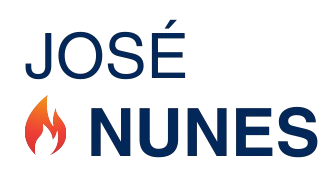

<div align="center">

  

  # José Nunes Lda
  
  **Distribuidor Oficial Repsol | Gondomar • Rio Tinto • Valbom**

  <p align="center">
    <a href="#-funcionalidades">Funcionalidades</a> •
    <a href="#-tech-stack">Tecnologias</a> •
    <a href="#-como-começar">Começar</a> •
    <a href="#-contactos">Contactos</a>
  </p>

  [](https://react.dev/)
  [](https://tailwindcss.com/)
  [](https://vitejs.dev/)
  [](https://www.repsol.pt/)

</div>

<br />

## 📋 Sobre o Projeto

Bem-vindo ao repositório oficial da nova presença digital da **José Nunes Lda**. Esta aplicação web moderna foi desenvolvida para elevar a experiência dos nossos clientes, oferecendo uma forma rápida, intuitiva e elegante de consultar os nossos produtos e serviços.

> "Energia que move o mundo com soluções sustentáveis e inovadoras."

---

## 🚀 Funcionalidades

### 🎨 Experiência de Utilizador (UX/UI)
- **Design Premium**: Interface sofisticada e limpa, focada na usabilidade.
- **Responsividade Total**: Otimizado para telemóveis, tablets e computadores.
- **Animações Suaves**: Transições fluidas com `framer-motion` que dão vida à aplicação.

### 🛍️ Catálogo Digital
- **Garrafas de Gás**: Informação detalhada sobre garrafas de Butano e Propano.
- **Gasóleo de Aquecimento**: Página dedicada com benefícios e dicas de manutenção.
- **Visualização Clara**: Imagens de alta qualidade e descrições precisas.

### ⚡ Performance & S
- **Carregamento Instantâneo**: Powered by Vite para uma navegação sem espera.
- **SEO Otimizado**: Meta-tags dinâmicas para melhor visibilidade nos motores de busca.

---

## 🛠️ Tech Stack

Construído com as melhores ferramentas do ecossistema moderno:

| Categoria | Tecnologia | Descrição |
| :--- | :--- | :--- |
| **Core** |  | Biblioteca de interface de última geração |
| **Build Tool** |  | HMR instantâneo e builds otimizados |
| **Estilos** |  | Framework utilitário para design rápido |
| **Animações** |  | Biblioteca de animações poderosa |
| **Routing** |  | Navegação client-side robusta |

---

## 🏁 Como Começar

Siga estes passos para correr o projeto no seu computador:

```bash
# 1. Clonar o repositório
git clone https://github.com/seu-usuario/josenunesreact.git

# 2. Entrar na pasta
cd josenunesreact

# 3. Instalar dependências
npm install

# 4. Iniciar servidor local
npm run dev
```

O servidor iniciará em `http://localhost:5173`.

---

## � Contactos

Estamos sempre disponíveis para ajudar:

<div align="center">

| 📍 **Morada** | 📞 **Telefone** | 📱 **Telemóvel** | ✉️ **Email** |
| :--- | :--- | :--- | :--- |
| Travessa da Fontela, 370<br>4420-150 Gondomar | 224 830 326 | 933 368 655<br>913 703 072 | josenuneslda@gmail.com |

</div>

<br />

<div align="center">
  <sub>Desenvolvido com ❤️ para José Nunes Lda. © 2025</sub>
</div>
